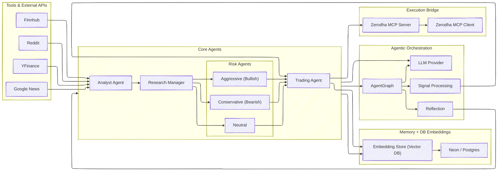

# FINAgent

A modular financial research and trading agent framework. It integrates market data tools, analysis agents, memory, a graph-based orchestration layer, and a Zerodha MCP bridge for execution and UI.

## Features
- Analysts for market, news, and social data
- Research and risk management managers
- Tools for data collection (Yahoo Finance, Google News, Reddit, Finnhub)
- Graph orchestration with signal processing and reflection
- Pluggable LLM provider(s)
- Persistent memory and NeonDB integration
- Zerodha MCP server/client bridge


## Mermaid Workflow
The high-level system workflow is outlined below.



## Project Structure
```
FINAgent/
  agents/                # Analysts, Researchers, Risk Managers, Trader
  data/                  # Local data assets/cache
  dataflows/             # Data pipelines and cached market data
  Langgraph/             # Graph orchestration and processing
  LLMs/                  # LLM provider integrations
  memory/                # Memory backends and registry
  NeonDB/                # Neon/Postgres utilities
  prompts/               # Prompt templates
  tools/                 # Data tools and registries
  ZerodhaMCP/            # MCP server/client integration for Zerodha
  main.py                # Entrypoint
  requirements.txt       # Python dependencies
  scripts/               # Utility scripts (e.g., registry validation)
```

The design follows Single Responsibility Principle (SRP) and a plug-and-play layout to simplify extension and maintenance.

## Prerequisites
- Python 3.10+
- Recommended: virtual environment (venv)

## Installation
```bash
python -m venv .venv
. .venv/Scripts/activate  # Windows PowerShell: .\.venv\Scripts\Activate.ps1
pip install -r requirements.txt
```

## Configuration
- Tools and API keys: check files under `tools/` (e.g., `FInnhub.py`, `GoogleNews.py`, `YFin.py`). Use environment variables where supported.
- Zerodha MCP config: `ZerodhaMCP/zerodha.json`.

## Run
- CLI/entrypoint:
```bash
python main.py
```
- Simple analysis example:
```bash
python simple_analysis.py
```

## Tests
```bash
python -m pytest -q
```
## License
Proprietary. All rights reserved.
